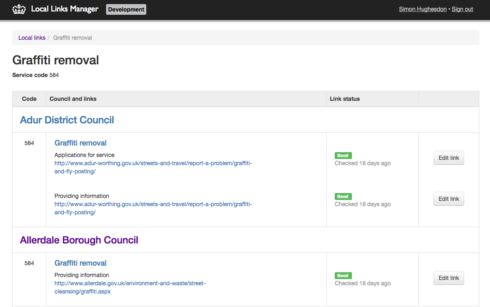

# Local-links-manager

Admin interface for managing Local Authorities links including all their services and interactions.

## Screenshots




## Live examples

- [Local Links Manager](https://local-links-manager.publishing.service.gov.uk)

## Nomenclature

- **SNAC** - Standard Names And Code - The old identifier code for locations. This is being phased out in favour of GSS codes.
- **GSS**  - Government Statistical Service - The new identifier code for locations.
- **LGSL** - Local Government Services List
- **LGIL** - Local Government Interactions List

Both LGSL and LGIL codes are used for the lookups for each Local Authority and its service interactions.

## Technical documentation

This is a Ruby on Rails application that maps RESTful URLs onto a persistence
layer. It's only presented as an internal API and doesn't face public users.

### Running the application

`./startup.sh`

### Running the test suite

`bundle exec rake`

### Developing Locally

If you are using the development vm before running any of the rake tasks below you will need to have [Mapit](https://github.com/alphagov/mapit) checked out locally.

You will also need to [import data from S3](https://github.com/alphagov/mapit/blob/master/import-db-from-s3.sh).

Links for each local authority are available via data replication.

## Detailed documentation

- [Adding a new LGSL code](/docs/adding-a-new-lgsl-code.md)
- [Deleting a local transaction link](/docs/deleting-a-link.md)

### Importing Local Authorities data

Before running the import rake tasks make sure you have Mapit running locally and have imported data into it.

Import all local authorities:

`bundle exec rake import:local_authorities:import_all`

Then import services and interactions:

`bundle exec rake import:service_interactions:import_all`

### Exporting Local Authority links to services

Exports are run daily and produce a `links_to_services_provided_by_local_authorities.csv`
file in the `public/data` directory. This is publicly available at
https://local-links-manager.publishing.service.gov.uk/links-export which
redirects to the static file at `/data/links_to_services_provided_by_local_authorities.csv`
at present.

A link to this file is published at https://data.gov.uk/dataset/local-authority-services.
They also host a cached, zipped version which is updated daily.

The file contains the following headers (we tried to keep these as similar to
the localdirect.gov.uk file as possible) :

| Header             | Description                                                               |
|--------------------|---------------------------------------------------------------------------|
| Authority Name     | The name of the local authority                                           |
| SNAC               | The SNAC of the local authority                                           |
| GSS                | The GSS code of the local authority                                       |
| Description        | The name of the service defined by the combination of LGSL and LGIL codes |
| LGSL               | The Local Government Service List code for the service                    |
| LGIL               | The Local Government Interaction List code for the service                |
| URL                | The URL corresponding to the local authority's provision of the service   |
| Supported by GOV.UK| Whether the GOV.UK website uses this link                                 |

The file is generated by running the rake task:

`bundle exec rake export:links:all`

### Example API output

**Endoint for local authorities**

`GET /api/local-authority?authority_slug=<authority_slug>`

This takes parameters for Authority Slug.

Returns a JSON array containing details for the local authority and (if appropriate), the county council that contains the district.

This example is for `GET /api/local-authority?authority_slug=rochford`
```
[
  {
    "name" => 'Rochford District Council',
    "homepage_url" => "http://rochford.example.com",
    "tier" => "district"
  },
  {
    "name" => 'Essex County Council',
    "homepage_url" => "http://essex.example.com",
    "tier" => "county"
  }
]
```

This example is for `GET /api/local-authority?authority_slug=camden`
```
[
  {
    "name" => 'Camden Borough Council',
    "homepage_url" => "http://camden.example.com",
    "tier" => "unitary"
  }
]
```

We do not require authentication for this request.

**Endpoint for local transactions links**

`GET /api/link?authority_slug=<authority_slug>&lgsl=<lgsl>&lgil=<lgil>`

This takes parameters for Authority Slug, LGSL and optionally LGIL.

Returns JSON details for local authority and interaction or just local authority depending whether the LGIL parameter is passed in. If the LGIL is passed in we return the link for the LGIL if it exists. If not then only the local authority details are returned. If the LGIL is not passed in it returns the appropriate fallback link. If no appropriate link is found then once again we only return the local authority details.

```
{
  "local_authority" => {
    "name" => "Blackburn",
      "snac" => "00AG",
      "tier" => "unitary",
      "homepage_url" => "http://blackburn.example.com",
  },
    "local_interaction" => {
      "lgsl_code" => 2,
      "lgil_code" => 4,
      "url" => "http://blackburn.example.com/abandoned-shopping-trolleys/report",
    }
}
```

We do not require authentication for this request.

### Checking Links

`bundle exec rake check-links`

This long running rake task performs a `GET` request using [a timeout and a redirect limit](https://github.com/alphagov/local-links-manager/blob/master/lib/local-links-manager/check_links/link_checker.rb#L4L5) against each active link.  It stores the HTTP status code of the result (or the error condition that it encountered).  The status is shown in the UI to help identify links that need to be fixed.

A digest of the results is available for interaction links at:

https://local-links-manager.publishing.service.gov.uk/check_links_status.csv

and for homepages at:

https://local-links-manager.publishing.service.gov.uk/check_homepage_links_status.csv

The output resembles the following:

|      status       | count |
| ----------------- | ----- |
|    Invalid URI    |   231 |
| Connection failed |   524 |
|        500        |    26 |
|        200        | 36599 |
| Too many redirects|     4 |
|        503        |   110 |
|   Timeout Error   |   194 |
|        401        |     6 |
|        410        |    72 |
|        404        |  2518 |
|     SSL Error     |    69 |
|        403        |   229 |


## Licence

[MIT License](LICENCE)
